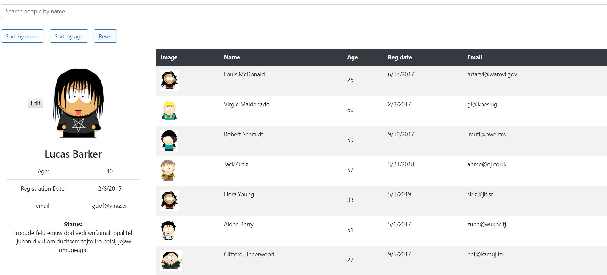

This project was bootstrapped with [Create React App](https://github.com/facebook/create-react-app).
Clone repository
### 'git clone https://github.com/YuraEremok/react-startmatter-test.git'

In the project directory, you can run:
### `npm install`

Start app
### `npm start`

Start json server,pre-selecting a free port,example
### `json-server --watch db.json --port 3004`

This app uses React,redux,redux-saga,react-bootstrap,json-server

